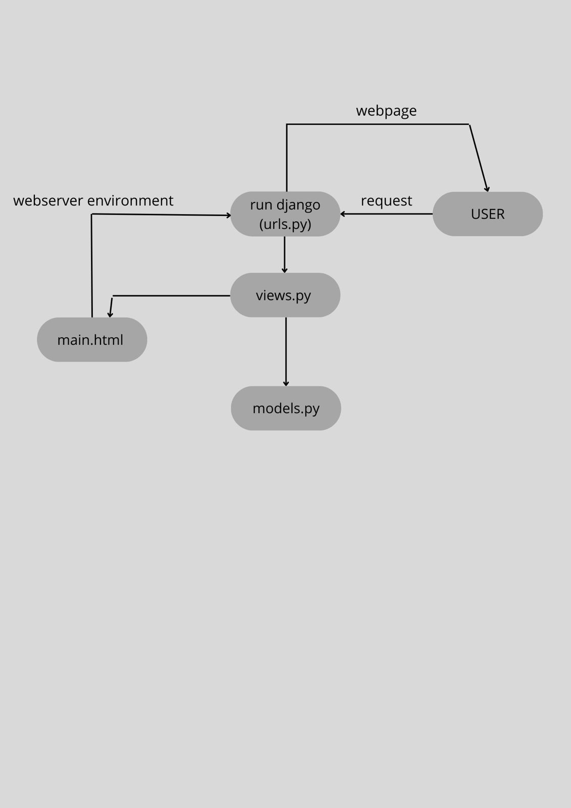

STEP BY STEP
- direktori main adalah direktori dari aplikasinya
- direktori house-of-kyny adlaah direktori project

1. kita perlu membuat sebuah direktori untuk aplikasi main.
2. daftarkan main ke dalam project house-of-kyny
3. membuat direktori templates didalam direktori main yang sbeelumnya sudah kita buat, dan isi dari direktori templates adalah template yang berguna untuk menampilkan data program 
4. Buat file main.html di dalam direktori templates
5. Isi file main.html dengan informasi aplikasi, dimana isinya adalah nama aplikasinya, nama , npm, kelas.
6. membuka file models.py dalam direktori main
7. lakukan migrasi model, Setelah mengubah model, jalankan migrasi untuk memperbarui struktur database.
8. hubungkan views.py dengan template
9. Buat fungsi show_main di views.py dalam direktori main
10. modifikasi main.html 
11. routing URL main dengan membuat file urls.py dalam direktori main
12. Routing URL 'house of kyny' digunakan untuk menambahkan rute URL ke dalam urls.py project dan menghubungkannya dnegan tampilan main.
13. deploy ke PWS.

Buatlah bagan yang berisi request client ke web aplikasi berbasis Django beserta responnya dan jelaskan pada bagan tersebut kaitan antara urls.py, views.py, models.py, dan berkas html.

request dari para klien -> web server environment -> menjalankan django -> permintaanya kemudian diteruskan ke views.py -> didalam views.py, django akan mencari data terkait menggunakan models.py -> Data yang ditemukan akan dikembalikan ke template HTML untuk ditampilkan kepada pengguna -> menampilkan respon para klien

fungsi git dalam pengembangan perangkat lunak
Git adalah Salah satu perangkat lunak atau tools kolaborasi coding yang sering dipakai karena mudah dan fleksibel. Jika sedang mengembangkan proyek kolaborasi untuk membuat software atau aplikasi,
git berfungsi sebagai sistem kontrol versi untuk menyimpan, mengelola, dan berbagi kode sumber secara efektif dan kolaboratif . 

mengapa framework Django dijadikan permulaan pembelajaran pengembangan perangkat lunak?
- Mudah untuk Dimengerti, karena Django dirancang untuk memudahkan pemula memahami konsep-konsep dasar pengembangan web. 
- Skalabilitas : Django kuat untuk menangani aplikasi-aplikasi berskala besar 
- Terorganisir dan Tertata: Framework ini mengadopsi pola desain Model-View-Template (MVT) yang membantu pemula memahami pemisahan tanggung jawab dalam aplikasi web.

Model dalam Django disebut sebagai ORM (Object-Relational Mapping) karena mereka berfungsi sebagai jembatan antara objek-objek dalam kode Python dan tabel-tabel dalam basis data relasional. ORM memungkinkan pengembang untuk mengelola data menggunakan konsep objek dari bahasa pemrograman, tanpa perlu menulis query SQL secara langsung untuk berinteraksi dengan basis data.